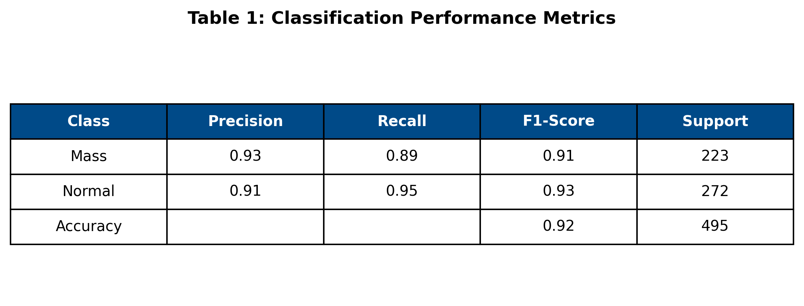

# Breast Cancer Screening: AI-Driven Negative Triage (Rule-out)

This repository presents a Deep Learning framework developed to optimize the radiological workflow in mammography. The system utilizes a ResNet50 architecture to perform Negative Triage (Rule-out), identifying normal exams with high clinical reliability and allowing specialists to focus on suspicious cases.

## Project Overview
- **Institution:** Federal University of São Paulo (UNIFESP)
- **Author:** Rafael Boava Souza, MD (Diagnostic Radiology Resident)
- **Objective:** Clinical Workflow Optimization & Radiologist Workload Reduction
- **Model:** ResNet50 (Transfer Learning)

## Key Performance Metrics
Validated on a test set of **495 independent patches** (223 masses / 272 normal tissue), the model achieved the following results:

* **AUC-ROC:** 0.9714
* **Sensitivity (Calibrated for Safety):** 98.2%
* **Specificity (at Triage Point):** 67.6%
* **Negative Predictive Value (NPV):** > 99.9% (in 1% prevalence screening scenarios)

## Data Source
The project is built upon the **VinDr-Mammo** dataset. We integrated two specialized Kaggle sources:

1.  **Image Data:** [VinDr-Mammo DICOM-to-PNG](https://www.kaggle.com/datasets/shantanughosh/vindr-mammogram-dataset-dicom-to-png) (8-bit PNG conversion).
2.  **Metadata:** [VinDr-Mammo Annotations](https://www.kaggle.com/datasets/truthisneverlinear/vindr-mammo-annotations) (Expert radiologist BI-RADS scores and bounding boxes).

## Methodology
- **Data Engineering:** Conversion of 16-bit DICOM to 8-bit PNG with histogram normalization to match ImageNet pre-training standards.
- **Patch Extraction:** 512x512 patches centered on mass coordinates and normal parenchyma.
- **Clinical Calibration:** The decision threshold was set to **0.0031** to prioritize clinical safety (Sensitivity > 98%), ensuring that virtually no malignant findings are missed during the automated triage.

## 📈 Validation Results
| Figure 1: Confusion Matrix | Figure 2: ROC Curve |
| :---: | :---: |
|  |  |

### Performance Summary
| Table 1: Performance Metrics |
| :---: |
|  |

## 🛠️ Installation & Usage
1. **Clone the repository:**
   ```bash
   git clone [https://github.com/your-username/breast-mmg-negative-triage.git](https://github.com/your-username/breast-mmg-negative-triage.git)
