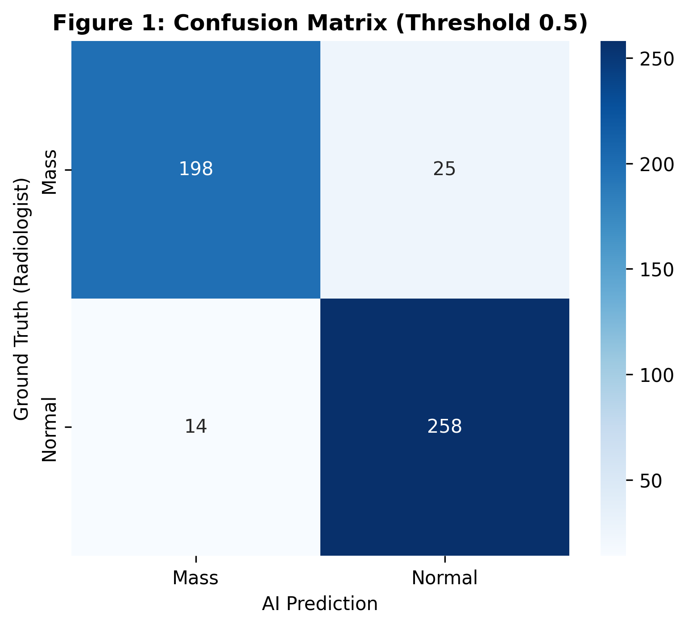
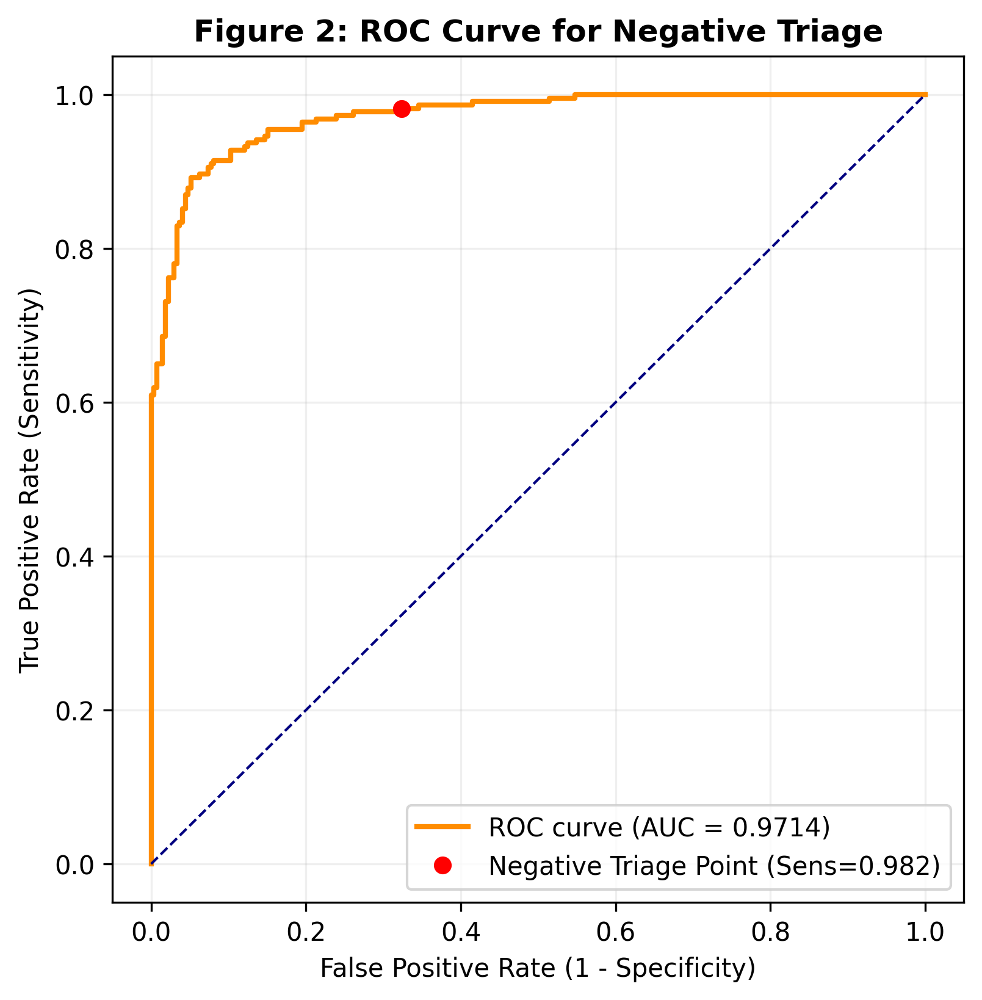

# Breast Cancer Screening: AI-Driven Negative Triage (Rule-out)

This repository presents a Deep Learning framework designed to optimize radiological workflow in mammography through **AI-driven negative triage (rule-out)**. The system leverages a ResNet50 architecture to safely exclude normal exams with high sensitivity, enabling radiologists to prioritize suspicious cases.

---

## Project Overview
- **Institution:** Federal University of São Paulo (UNIFESP)
- **Author:** Rafael Boava Souza, MD (Diagnostic Radiology Resident)
- **Objective:** Clinical workflow optimization and radiologist workload reduction
- **Model:** ResNet50 (Transfer Learning)

---

## Key Performance Metrics

Validated on an independent test set of **495 patches** (223 nodules / 272 normal), the model achieved:

- **AUC-ROC:** 0.9714  
- **Accuracy:** 92%  
- **Sensitivity (Recall – Nodules):** 89%  
- **Specificity (Normal class):** 95%  
- **F1-score:** 0.91 (nodules) / 0.93 (normal)

### Negative Triage Operating Point (Clinical Calibration)
To simulate real-world deployment, the model was calibrated for **high-sensitivity triage**:

- **Sensitivity:** 98.2%  
- **Specificity:** ~65–68%  
- **Decision Threshold:** 0.0031  

This configuration prioritizes **clinical safety**, minimizing false negatives.

---

## Confusion Matrix & ROC Analysis

| Figure 1: Confusion Matrix | Figure 2: ROC Curve |
| :---: | :---: |
|  |  |

---

## Performance Summary

| Class   | Precision | Recall | F1-score | Support |
|--------|----------|--------|----------|--------|
| Nodule | 0.93     | 0.89   | 0.91     | 223    |
| Normal | 0.91     | 0.95   | 0.93     | 272    |
| **Accuracy** | — | — | **0.92** | 495 |

---

## Clinical Workflow Impact Simulation

A key contribution of this project is translating model performance into **practical clinical impact**.

### Simulated Scenarios (n = 1,000 exams)

| Prevalence | Setting     | Workload Reduction | NPV     |
|-----------|------------|-------------------|--------|
| 1.0%      | Screening  | **67.0%**          | **99.97%** |
| 5.0%      | Diagnostic | **64.3%**          | **99.86%** |

---

## Clinical Interpretation

- The model functions as a **high-safety triage filter**, excluding a large proportion of normal exams.
- In **screening scenarios (1% prevalence)**:
  - ~**2/3 of exams** could be safely deprioritized
  - **NPV ~99.97%** ensures extremely low risk of missed disease
- This aligns with the concept of **AI-assisted workload reduction without compromising diagnostic safety**

---

## Data Source

The project is based on the **VinDr-Mammo dataset**, combining:

1. **Image Data:**  
   https://www.kaggle.com/datasets/shantanughosh/vindr-mammogram-dataset-dicom-to-png  

2. **Annotations:**  
   https://www.kaggle.com/datasets/truthisneverlinear/vindr-mammo-annotations  

Includes expert radiologist annotations (BI-RADS + bounding boxes).

---

## Methodology

- **Preprocessing:**  
  Conversion from 16-bit DICOM to 8-bit PNG with histogram normalization

- **Patch Extraction:**  
  512×512 patches centered on annotated lesions and normal tissue

- **Model:**  
  ResNet50 with transfer learning (ImageNet pretraining)

- **Clinical Calibration:**  
  Threshold adjusted (**0.0031**) to prioritize **high sensitivity (>98%)**, enabling safe rule-out

---

## Key Insight

Unlike traditional classification tasks, this model is optimized for:

> **“Ruling out disease safely rather than detecting every lesion”**

This shift enables:

- Scalable screening workflows  
- Reduced radiologist burden  
- Safer integration of AI into clinical pipelines  

---

## Installation & Usage

1. Clone the repository:
   ```bash
   git clone https://github.com/your-username/breast-mmg-negative-triage.git
   cd breast-mmg-negative-triage

2. Install dependencies:
   ```bash
   pip install -r requirements.txt

3. Run the project:
   This project is structured as a research notebook pipeline.
   To reproduce the results, open and execute:
    ```bash
   jupyter notebook Official_MMG_project_fixed.ipynb
